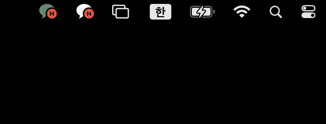

# Dual KakaoTalk for macOS

[한국어](README.md) | [English](README.en.md)

공식 `/Applications/KakaoTalk.app`을 기반으로 별도의 `/Applications/KakaoTalkWork.app`을 만들어 개인용·듀얼 카카오톡을 동시에 사용할 수 있게 합니다. 듀얼 앱은 Dock과 앱 전환기에서 `듀얼 카카오톡`으로 표시되며, 메뉴 막대 아이콘은 초록색(`#5B8A72`)으로 로컬에서 변경됩니다.

> [!WARNING]
> 본 프로젝트는 저장소 소유자와 다운로드 폴더를 신뢰하는 지인을 위한 제한적 베타입니다. ad-hoc 서명, 관리자 권한 승인 및 비공개 macOS CoreUI API를 사용하며, 공증된 일반 공개 설치 프로그램이 아닙니다. 실행하기 전에 GitHub Release에 표시된 ZIP SHA-256을 확인하세요. Apple 또는 KakaoTalk 업데이트로 동작이 중단될 수 있습니다. Intel macOS 13과 Apple M3 macOS 26.5.2에서 검증했습니다.

## 실제 실행 화면

개인용 카카오톡과 듀얼 카카오톡을 동시에 실행한 모습입니다.


듀얼 앱의 메뉴 막대 아이콘은 초록색으로 표시됩니다.



Dock에서는 표시 이름으로 두 앱을 구분할 수 있습니다.

| 개인용 카카오톡 | 듀얼 카카오톡 |
| --- | --- |
|  |  |

## 요구 사항

- macOS Ventura 13 이상
- 공식 KakaoTalk: `/Applications/KakaoTalk.app`
- 현재 지원 버전: KakaoTalk 26.6.1 (빌드 1190)
- 최종 사용자는 Xcode가 필요하지 않습니다.

## 설치 또는 업데이트

1. 공식 KakaoTalk을 `/Applications/KakaoTalk.app`에 설치하거나 지원 버전으로 업데이트합니다.
2. [최신 Release](https://github.com/hubeen/dual-kakaotalk-macos/releases/latest)에서 ZIP 파일을 다운로드하고 압축을 풉니다.
3. 개인용·듀얼 카카오톡을 모두 종료합니다.
4. 압축을 푼 폴더의 `Install.command`를 **우클릭 → 열기 → 열기**로 실행합니다.
5. macOS 관리자 인증 창에서 비밀번호 또는 Touch ID로 승인합니다.
6. 설치가 끝나면 다음 앱이 함께 실행됩니다.
   - 개인용: `/Applications/KakaoTalk.app`
   - 듀얼 카카오톡: `/Applications/KakaoTalkWork.app`

공식 KakaoTalk을 업데이트한 뒤에는 두 앱을 종료하고 최신 릴리스의 `Install.command`를 다시 실행하세요. 동일한 명령이 신규 설치와 업데이트를 모두 처리합니다. 기존 듀얼 카카오톡은 교체 전에 백업되며 설치가 실패하면 복구됩니다.

## 제거

1. 듀얼 카카오톡을 종료합니다.
2. 릴리스 폴더의 `Uninstall.command`를 **우클릭 → 열기 → 열기**로 실행합니다.
3. macOS 관리자 인증 창에서 승인합니다.

제거 프로그램은 `/Applications/KakaoTalkWork.app`만 삭제합니다. 원본 `/Applications/KakaoTalk.app`, 계정·대화 데이터, 키체인 및 `~/Library/Logs/DualKakaoTalk/`의 설치 로그는 삭제하지 않습니다. 앱이 이미 없으면 성공으로 종료하며, 고정 경로가 심볼릭 링크이거나 예상 번들 ID와 다르면 안전을 위해 삭제하지 않습니다.

## 설치 프로그램이 수행하는 작업

- 공식 앱의 고정 경로, 번들 ID, 버전, 빌드, Kakao Team ID, 서명 및 `Assets.car` SHA-256 검증
- 사용자 권한으로 전체 앱 복사·아이콘 변경·ad-hoc 서명·검증
- 고정 형식과 digest로 제한된 요청만 관리자 권한으로 가져오기
- 설치 잠금 및 write-ahead 복구 저널을 통한 중복 실행·중단 복구
- 설치·제거 중 전용 macOS 진행 표시줄과 단계별 상태 문구 표시
- 듀얼 카카오톡의 이름, 실행 파일 및 번들 ID를 다음 값으로 고정
  - 이름·실행 파일: `KakaoTalkWork`
  - 번들 ID: `com.kakao.KakaoTalkWorkMac`
- 설치 완료 후 개인용·듀얼 카카오톡 실행

다음 항목은 접근하거나 변경하지 않습니다.

- 카카오톡 계정 및 대화 데이터
- Keychain
- Dock 고정 항목 및 Dock 환경설정
- 백그라운드 감시 프로그램

## 오류 로그와 이슈 등록

설치 로그와 제거 로그는 다음 위치에 각각 저장되며 종류별로 최근 5개만 유지됩니다.

```text
~/Library/Logs/DualKakaoTalk/
```

로그 폴더 권한은 `0700`, 로그 파일 권한은 `0600`입니다. `install-*.log`에는 installer 버전, helper 정보, KakaoTalk 정보와 설치 결과가 기록됩니다. `uninstall-*.log`에는 uninstaller 버전, 제거 대상 bundle ID, 제거 결과 및 데이터 보존 여부가 기록됩니다. 두 로그 모두 UTC 시각, macOS 버전·빌드, CPU 아키텍처, 성공 여부, 실패 단계·종료 코드·실패 줄을 `diagnostic.*` 형식으로 포함하며 사용자 홈과 임시 경로를 자동 치환합니다. 설치 또는 제거 실패 시 해당 로그를 표시하고 전용 GitHub 이슈 양식을 열 것인지 먼저 묻습니다. 로그는 자동 업로드되지 않습니다. 제출 전 개인정보가 없는지 확인한 뒤 설치 양식에는 **구조화된 설치 로그**, 제거 양식에는 **구조화된 제거 로그**를 붙여 넣으세요.

## 소스 빌드와 테스트

기여자는 macOS 13 이상, Xcode/Swift 및 Intel·Apple Silicon SDK가 필요합니다.

```sh
swift test
./Scripts/verify-no-kakao-assets.sh
./Scripts/build-release.sh
```

릴리스에는 x86_64와 arm64가 포함된 Universal helper가 들어갑니다. `Assets.car` 변경은 정확히 허용된 fingerprint와 메뉴 아이콘 16개에만 제한됩니다. 비공개 API 위험과 독립 writer 전환 계획은 [Docs/FEASIBILITY.md](Docs/FEASIBILITY.md) 및 [Docs/INDEPENDENT-WRITER.md](Docs/INDEPENDENT-WRITER.md)를 참고하세요.

## 제한 사항

- 공식 앱 업데이트는 듀얼 카카오톡에 자동 반영되지 않으므로 `Install.command`를 다시 실행해야 합니다.
- ad-hoc 서명 때문에 macOS 보안 경고가 나타날 수 있습니다.
- Apple 또는 KakaoTalk 내부 형식이 바뀌면 설치가 차단될 수 있습니다.
- M1~M5는 동일한 arm64 Universal 빌드를 사용하므로 칩별 구현 차이는 없습니다. M3/macOS 26.5.2는 실제 검증했으며 나머지 칩·macOS 조합은 추가 실기기 검증이 필요합니다.
- 본 릴리스는 신뢰하는 사용자 범위 밖에 일반 배포하기 위한 공증 설치 프로그램이 아닙니다.

## 비제휴 및 권리 고지

본 프로젝트는 Kakao Corp.와 제휴하거나 Kakao의 승인·후원을 받은 프로젝트가 아닙니다. KakaoTalk 관련 명칭, 상표, 아이콘 및 애플리케이션 자산의 권리는 각 권리자에게 있습니다. MIT 라이선스는 본 프로젝트가 독자적으로 작성한 소스 코드에만 적용됩니다.

저장소와 릴리스에는 Kakao 실행 파일, 앱 번들, 원본 아이콘, `Assets.car` 또는 파생된 Kakao 이미지 픽셀을 포함하거나 재배포하지 않습니다. `Docs/Images`에는 개인정보를 제거하고 기능 확인에 필요한 범위로 자른 실행 화면만 포함합니다. 메뉴 막대 아이콘 변경은 사용자의 Mac에 설치된 공식 앱에서 로컬로 생성됩니다.
